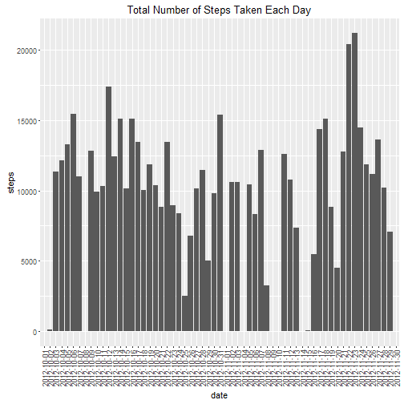
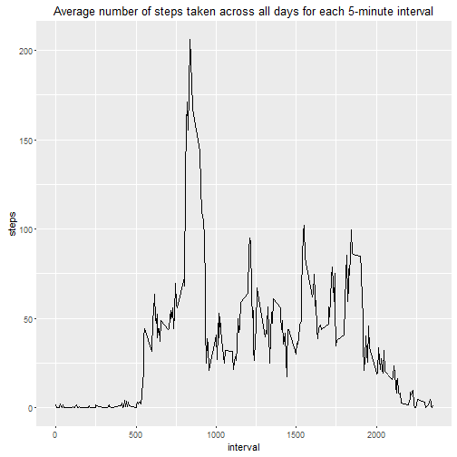
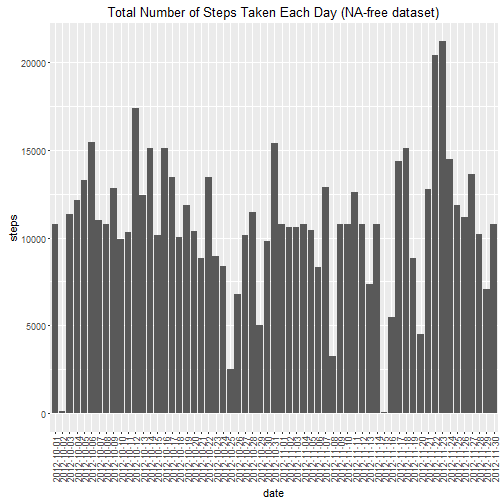
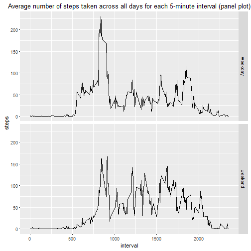

Reproducibe Research Course Project 1
=====================================

#### *Author: Ivan*

## 1. Preliminary Procedures  
  
#### i. Load required libraries  


```r
library(dplyr) ##for data pre-processing
library(ggplot2) ##for visualization
```
  
#### ii. Read activity data  


```r
##setwd("c5w2/") ##NOT RUN
activityData <- read.csv("activity.csv")
```
  
## 2. What is the mean total number of steps taken per day?  
  
#### i. Get total number of steps taken per day  


```r
dateGroup <- group_by(activityData[,c("steps","date")],date)
dateGroupSum <- summarize_each(dateGroup,funs(sum))
```
  
#### ii. Plot histogram  


```r
histplot <- ggplot(data=dateGroupSum,aes(x=date,y=steps))+geom_bar(stat="identity")
histplot <- histplot + ggtitle("Total Number of Steps Taken Each Day")
histplot <- histplot + theme(axis.text.x=element_text(angle=90,vjust=0.5,hjust=1)) ##rotate x label
print(histplot)
```

```
## Warning: Removed 8 rows containing missing values (position_stack).
```


  
#### iii. Get mean and median of the total number of steps taken each day  

Get mean and median from summary function.


```r
stMed <- as.integer(summary(dateGroupSum$steps)[3]) ##median
stMean <- as.integer(summary(dateGroupSum$steps)[4]) ##mean
```

The mean of the total number of steps taken each day is 10770.  
The median of the total number of steps taken each day is 10760.
  
## 3. What is the average daily activity pattern?  
  
#### i. Get average number of steps taken across all days for each 5-minute interval  


```r
intervalGroup <- group_by(activityData[,c("steps","interval")],interval)
intervalGroupMean <- summarize_each(intervalGroup,funs(mean(.,na.rm=T)))
```
  
#### ii. Plot time series  


```r
tsplot <- ggplot(data=intervalGroupMean,aes(x=interval,y=steps))+geom_line()
tsplot <- tsplot + ggtitle("Average number of steps taken across all days for each 5-minute interval")
print(tsplot)
```


  
#### iii. Get the 5-minute interval, on average across all the days which contains the maximum number of steps  


```r
maxStepsPosition <- which.max(intervalGroupMean$steps) ##get row of max steps
maxStepsInt <- intervalGroupMean[maxStepsPosition,]$interval
```

The 5-minute interval, on average across all the days which contains the maximum number of steps is 835.
  
## 4. Imputing missing values  
  
#### i. Get total number of rows which have missing values  


```r
naRows <- length(which(apply(activityData,1,function(x)any(is.na(x)))))
naSteps <- length(which(is.na(activityData$steps)))
naDate <- length(which(is.na(activityData$date))) ##0
naInterval <- length(which(is.na(activityData$interval))) ##0
```

Total number of rows with missing values in the dataset is 2304.  
Number of missing values (NA) in the column 'steps' is 2304.  
Number of missing values (NA) in the column 'date' is 0.  
Number of missing values (NA) in the column 'interval' is 0.

Hence, missing values imputation only required for the column 'steps'.
  
#### ii. Replacing missing values  

Missing values found in 'steps' column of the dataset will be replaced with the mean of the total number of steps taken in that particular 5-minute interval across all days, which would be the best approximate for the activity that could be carried at that time, e.g. the respondent could have high probability having the similar activity level at a particular time within a day.


```r
meanReference <- intervalGroupMean ##using intervalGroupMean from above
updatedAD <- activityData ##create new dataset which will have the NAs filled up

for (i in 1:nrow(updatedAD))
{
        if (is.na(updatedAD[i,]$steps))
        {
                updatedAD[i,]$steps <- meanReference[meanReference$interval==updatedAD[i,]$interval,]$steps
        }
}
```
  
#### iii. Get total number of steps taken per day (NA-free dataset)  


```r
dateGroup2 <- group_by(updatedAD[,c("steps","date")],date)
dateGroupSum2 <- summarize_each(dateGroup2,funs(sum))
```
  
#### iv. Plot histogram (NA-free dataset)  


```r
histplot2 <- ggplot(data=dateGroupSum2,aes(x=date,y=steps))+geom_bar(stat="identity")
histplot2 <- histplot2 + ggtitle("Total Number of Steps Taken Each Day (NA-free dataset)")
histplot2 <- histplot2 + theme(axis.text.x=element_text(angle=90,vjust=0.5,hjust=1)) ##rotate x label
print(histplot2)
```


  
#### v. Get mean and median of the total number of steps taken each day (NA-free dataset)  

Get mean and median from summary function.


```r
stMed2 <- as.integer(summary(dateGroupSum2$steps)[3]) ##median
stMean2 <- as.integer(summary(dateGroupSum2$steps)[4]) ##mean
```

The mean of the total number of steps taken each day is 10770.  
The median of the total number of steps taken each day is 10770.
  
#### vi. Comparing between initial dataset and NA-free dataset  


```r
compTable <- data.frame(c(stMed,stMean),c(stMed2,stMean2))
colnames(compTable) <- c("Median","Mean")
rownames(compTable) <- c("Initial dataset","NA-free dataset")
print(compTable)
```

```
##                 Median  Mean
## Initial dataset  10760 10770
## NA-free dataset  10770 10770
```

Referring to the above table generated, after missing values imputation, the median of the total number of steps taken each day is increased and is approaching to the value of mean.
  
## 5. Are there differences in activity patterns between weekdays and weekends?  
  
#### i. Create new variable, weekType  

Using NA-free dataset, convert 'date' variable from 'factor' to date-time classes.  
Create new factor variable with 2 levels, 'weekday' and 'weekend' based on the converted 'date' variable.


```r
updatedAD$date <- strptime(updatedAD$date,format="%Y-%m-%d") ##date conversion
weekTypeVec <- c()
for (j in 1:nrow(updatedAD)){
        if (weekdays(updatedAD[j,]$date) %in% c("Saturday","Sunday")){
                weekTypeVec <- c(weekTypeVec,"weekend")
        }
        else{
                weekTypeVec <- c(weekTypeVec,"weekday")
        }
}
updatedAD$weekType <- as.factor(weekTypeVec)
```
  
#### ii. Plot time series (panel plot)  


```r
##process
intervalGroupWeek <- group_by(updatedAD[,c("steps","interval","weekType")],interval,weekType)
intervalGroupWeekMean <- summarize_each(intervalGroupWeek,funs(mean(.,na.rm=T)))
##plot
tsplotPanel <- ggplot(data=intervalGroupWeekMean,aes(x=interval,y=steps))+geom_line()
tsplotPanel <- tsplotPanel + ggtitle("Average number of steps taken across all days for each 5-minute interval (panel plot)")
tsplotPanel <- tsplotPanel + facet_grid(weekType~.)
print(tsplotPanel)
```



From the above panel plot, we can observe that the respondent generally have higher number of steps during the early of the day during weekday compared to weekend. On the other hand, in the later of the day, slightly higher number of steps is recorded during weekend.
